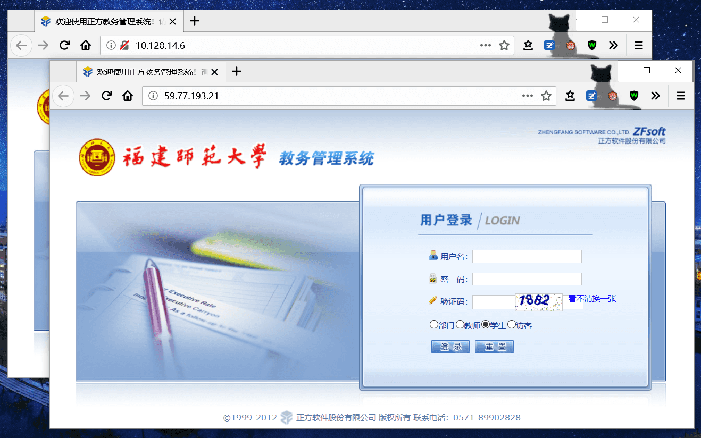
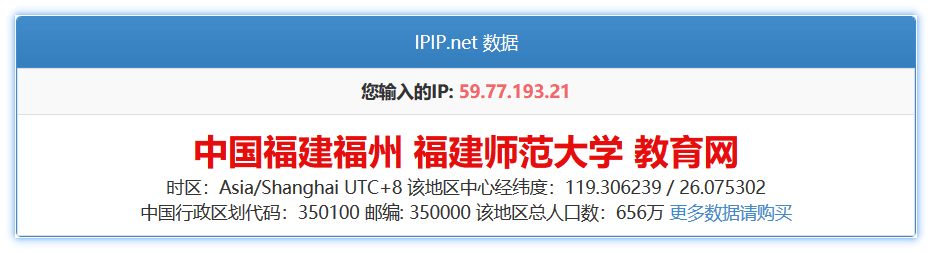

## 说明

福建师范大学教务管理系统网址为 [jwgl.fjnu.edu.cn](http://jwgl.fjnu.edu.cn) 。  

除该域名外，还有以下多个 IP 地址可用。推荐同学们在教务管理系统使用高峰时期（例如公共选修课选课、体育课选课）改用以下 IP 分流。它们与 [jwgl.fjnu.edu.cn](http://jwgl.fjnu.edu.cn) 的数据库是一样的。如果在这些 IP 地址对应的网站上选课后不放心，可以过后登录 jwgl.fjnu.edu.cn 查看。

**注意：** IP 信息可能存在时效性，目前（2018.03）以下验证可用。

## 教育网  

[59.77.193.21](http://59.77.193.21)  

备注：教育网 59.77.193.0 网段属于福建师范大学，可前往 [IPIP](https://www.ipip.net/) 查询。  

  

## 局域网（学校内网）  

[10.128.14.1](http://10.128.14.1)  
[10.128.14.6](http://10.128.14.6)  
[10.128.14.7](http://10.128.14.7)  
[10.128.14.8](http://10.128.14.8)  
[10.128.14.9](http://10.128.14.9)  
[10.128.14.10](http://10.128.14.10)  
[10.128.14.11](http://10.128.14.11)  
[10.128.14.12](http://10.128.14.12)  
[10.128.14.13](http://10.128.14.13)  
[10.128.14.14](http://10.128.14.14)  
[10.128.14.15](http://10.128.14.15)  
[10.128.14.17](http://10.128.14.17)  
[10.128.14.18](http://10.128.14.18)  
[10.128.14.19](http://10.128.14.19)  
[10.128.14.20](http://10.128.14.20)  

